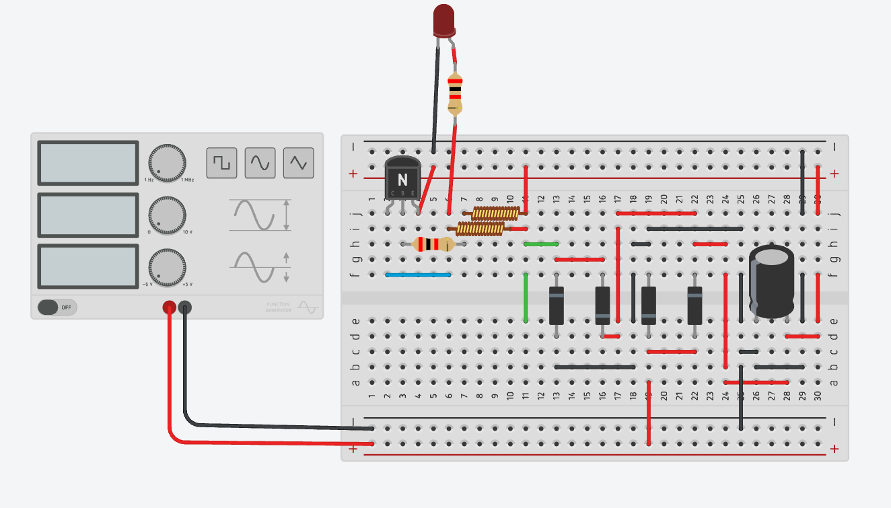

# Circuito de Lanterna de Faraday

## Visão Geral

Este projeto simula o funcionamento de uma Lanterna de Faraday, utilizando um circuito montado em uma placa de ensaio no Tinkercad. O objetivo principal é demonstrar a conversão de energia elétrica a partir de um gerador de função, a retificação da corrente alternada (CA) em corrente contínua (CC) e a amplificação do sinal para acender um LED.

## Componentes Utilizados

| Quantidade | Componente |
|------------|------------|
| 1 | LED Vermelho |
| 1 | Transistor NPN |
| 2 | Resistores |
| 2 | Indutores |
| 1 | Capacitor Polarizado |
| 4 | Diodos |
| 1 | Placa de Ensaio |
| 1 | Gerador de Função |

## Funcionamento do Circuito

1. **Geração de Sinal:** O **gerador de função** fornece um sinal alternado (CA), simulando a indução eletromagnética presente em uma lanterna de Faraday real.
2. **Indução e Filtragem:** Os **indutores** trabalham para estabilizar e condicionar o sinal elétrico.
3. **Retificação:** O conjunto de **quatro diodos** forma uma **ponte retificadora**, convertendo CA em CC.
4. **Armazenamento de Energia:** O **capacitor polarizado** atua como um filtro, suavizando a saída da tensão retificada.
5. **Amplificação:** O **transistor NPN** amplifica a corrente para garantir que o LED acenda corretamente.
6. **Controle de Corrente:** Os **resistores** evitam que correntes excessivas danifiquem os componentes do circuito.

## Conexões Principais

- O **gerador de função** está conectado aos terminais de entrada do circuito.
- Os **diodos** estão dispostos na configuração de ponte retificadora.
- O **capacitor polarizado** está conectado em paralelo à saída da ponte retificadora.
- O **transistor NPN** está posicionado como amplificador, controlando a corrente do LED.
- O **LED**, com um resistor em série, é alimentado pela saída do transistor.

## Aplicações

- Demonstração de conceitos de **indução eletromagnética**.
- Aprendizado sobre **retificação de corrente** e **filtragem de sinal**.
- Aplicação prática de **transistores como amplificadores**.
- Modelagem de uma **fonte de energia alternativa**, similar ao funcionamento de lanternas de Faraday reais.

## Melhorias Possíveis

- Utilizar um **supercapacitor** para armazenamento de energia mais eficiente.
- Implementar um circuito **step-up** para aumentar a tensão de saída.
- Testar diferentes valores de resistência para otimizar a eficiência do LED.

## Conclusão

Este projeto é uma ótima maneira de estudar os conceitos de eletrônica aplicada, combinando **geração de energia**, **retificação**, **armazenamento** e **amplificação** em um único circuito funcional. A simulação no **Tinkercad** permite observar o comportamento dos componentes e realizar ajustes antes da montagem física do circuito.
