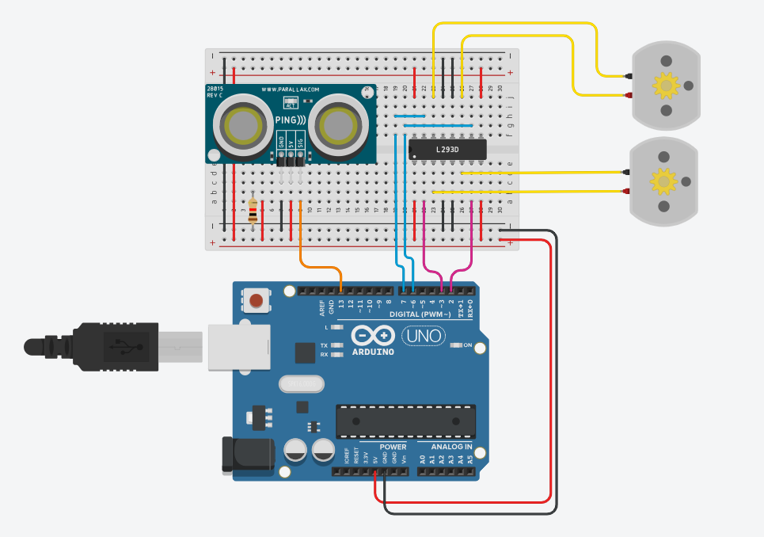

# Robo Desviador



Este projeto apresenta um robô capaz de evitar obstáculos usando sensores e um algoritmo de evasão. O esquema elétrico exibido acima foi feito no thinkercad e apresentado em sala de aula.
Link: https://www.tinkercad.com/things/9M25Ux57Fd2-robo-desviador

## Imagem Demonstrativa do Robo


## Demonstração de Como Seria o Funcionamento do Robo


```cpp

    int distancia = 0;

    long lerDistanciaUltrassonica(int pinoTrigger, int pinoEcho)
    {
    pinMode(pinoTrigger, OUTPUT);
    digitalWrite(pinoTrigger, LOW);
    delayMicroseconds(2);
    digitalWrite(pinoTrigger, HIGH);
    delayMicroseconds(10);
    digitalWrite(pinoTrigger, LOW);
    pinMode(pinoEcho, INPUT);
    return pulseIn(pinoEcho, HIGH);
    }

    void setup()
    {
    Serial.begin(9600);
    pinMode(2, OUTPUT);
    pinMode(3, OUTPUT);
    pinMode(6, OUTPUT);
    pinMode(7, OUTPUT);
    }

    void loop()
    {
    distancia = 0.01723 * lerDistanciaUltrassonica(13, 12);
    Serial.println(distancia);
    
    if (distancia < 15) {
        digitalWrite(2, LOW);
        digitalWrite(3, HIGH);
        digitalWrite(6, LOW);
        digitalWrite(7, HIGH);
        delay(500);
        pararMotores();
        delay(150);
        virarDireita();
        delay(600);
        pararMotores();
        delay(150);
        moverParaFrente();
    } 
    else {
        moverParaFrente();
    }

    delay(10);
    }

    void pararMotores() {
    digitalWrite(2, LOW);
    digitalWrite(3, LOW);
    digitalWrite(6, LOW);
    digitalWrite(7, LOW);
    }

    void moverParaFrente() {
    digitalWrite(2, HIGH);
    digitalWrite(3, LOW);
    digitalWrite(6, HIGH);
    digitalWrite(7, LOW);
    }

    void virarDireita() {
    digitalWrite(2, HIGH);
    digitalWrite(3, LOW);
    digitalWrite(6, LOW);
    digitalWrite(7, HIGH);
    }
```

## Créditos

O vídeo e a imagem foi encontrada no canal: (Eduardo Fritzen - ConectaBit)